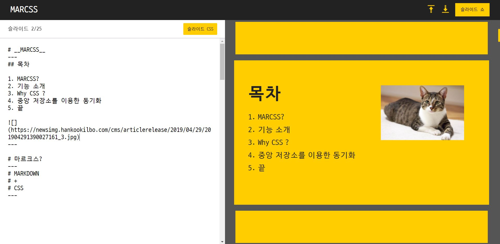
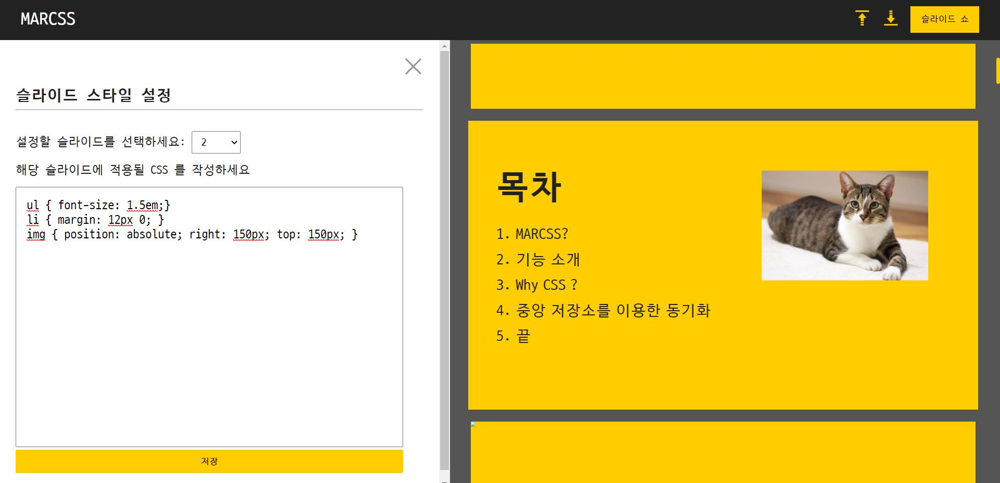

# MARCSS

#### 웹앱 주소

https://marcss.netlify.app/

### 소개

MARCSS 는 **MARKDOWN** 과 **CSS** 의 합성어로, 마크다운 문법과 CSS 문법을 이용해 발표 슬라이드를 제작할 수 있는 웹앱입니다. 

일반적인 마크다운 문법으로 내용을 작성한 후, 별도의 스타일링 탭에서 전체 슬라이드, 혹은 개별 슬라이드의 CSS 스타일링이 가능합니다. 

발표를 위한 전체화면 모드로의 진입이 가능합니다.

마크다운과 스타일링을 개별적으로 업로드하거나 다운로드 할 수 있기 때문에, 내용이나 스타일링을 재사용 할 수 있습니다. 

MARCSS 는 별도의 라이브러리 사용 없이 오직 **Vanilla Javascript** 만을 이용해서 제작되었습니다. 

(추가적인 개인 소감은 맨 아래 부분에 작성되어 있습니다.)

### 기능

#### 문법(마크다운)

1. 테이블을 제외한 대다수의 마크다운 문법이 지원됩니다.
1. `---` 만 있는 줄을 기준으로 슬라이드가 구분됩니다. 

#### 문법(CSS)

1. `전체` 셀렉트 값을 선택해서 CSS 를 작성하면 슬라이드 전체에 공통적으로 적용됩니다. (일종의 발표 테마 역할)
1. 슬라이드 번호 값을 선택하면 해당 번호의 슬라이드에 적용될 CSS 를 작성할 수 있습니다. 
1. 아무런 CSS 선택자 없이 `{}` 중괄호 속에 CSS 문법을 작성하면 해당 슬라이드 전체(하나의 큰 `
` 태그) 를 대상으로 CSS 를 작성합니다.
1. 마크다운이 어떤 html 요소로 변환되었는지 안다면 해당 태그를 선택자로 이용해 스타일링 할 수 있습니다. (예: `# Title` 처럼 작성된 마크다운은 `h1` 태그로 변환되므로 `h1 {}` 처럼 CSS 스타일링이 가능합니다.)
1. 위처럼 일반적인 CSS 문법을 지원하기 때문에 `:nth-of-type()` 같은 CSS 선택자를 활용하면 이미지 태그 등도 원하는대로 스타일링 할 수 있습니다.
1. 추가적으로, `@next {}`, `@prev {}` 와 같이 MARCSS 전용 CSS 선택자를 지원합니다. 해당 선택자들은 슬라이드 전환효과를 위한 것입니다. `@next` 는 다음 슬라이드인 상태일 때 어떤 스타일링 속성을 가지고 있어야 할지, `@prev` 는 이전 슬라이드인 상태일 때 어떤 스타일링 속성을 가지고 있어야 하는지를 정의합니다.

#### 전체화면 모드

#### 사용성 증진을 위한 기능

1. 마크다운 입력부, CSS 셀렉트 값에 따라 슬라이드 미리보기 출력부의 스크롤이 조절됩니다. 즉, 마크다운 텍스트의 일부를 클릭하거나, CSS 셀렉트 값을 변경할 때마다 미리보기 스크롤이 동기화됩니다.
1. 마찬가지로 미리보기 슬라이드를 클릭하면 해당 슬라이드에 맞는 마크다운 영역으로 스크롤 되고, CSS 셀렉트 값 또한 변경됩니다. 

#### 파일 가져오기, 내보내기 기능

1. 마크다운 파일을 가져오거나 내보내기 할 수 있습니다.
1. 스타일링 파일을 가져오거나 내보내기 할 수 있습니다. (현재는 MARCSS 에서 내보내기 한 값만을 JSON 형식으로 지원합니다.)
1. 마크다운과 스타일링이 모두 포함된 JSON 형식의 통합 파일도 가져오거나 내보내기 할 수 있습니다. 

#### 캡쳐 이미지

### 프로젝트 소감

이 레포는 인턴 기간에 진행했던 프로젝트를 기억 나는대로 빠르게 복제한 것으로, 원래 부족했던 부분 뿐만 아니라 추가적인 부족한 부분이 존재할 수 있습니다. 이 프로젝트에서 중점을 두고 구현했던 기능은 바닐라 자바스크립트만을 사용해서 Redux 와 유사한 프로젝트 상태 관리 코드를 짜는 것이었습니다. 웹앱의 여러 부분에서 공통적으로 조회되고 업데이트 되는 데이터를 관리하기 위해 중앙상태관리 역할을 하는 객체를 구현하는 데 우여곡절이 있었습니다.

  결과적으로 제가 중앙상태관리 객체를 구현하는 데 적용한 기술 아키텍쳐는 Flux 패턴입니다. 제게 익숙한 Flux 패턴은 Redux 여서 Redux 를 많이 참고하고자 했고, 따라서 거의 동일한 용어를 사용해서 Flux의 단방향 흐름을 구현했습니다. createStore 로 생성된 store 인스턴스를 생성하고, dispatch 메서드를 통해 reducer를 거쳐 변경된 값이 기존 store 를 업데이트하도록 했습니다. 그리고 이렇게 store 가 변경되면 그 store 를 사용하고 있는 컴포넌트에서 감지해서 사용자에게 보이는 화면을 다시 그릴 수 있도록 store 내부의 `observe` 라는 메서드를 통해 등록할 수 있고, dispatch 가 발생할 때마다 업데이트를 감지할 수 있도록 했습니다. 즉, 리덕스 내부의 pub-sub 패턴을 이해하고, 구현하고자 노력했습니다.

  리덕스를 많이 참고했지만 리덕스를 완벽하게 따라하지는 않았습니다. 우선 저는 리액트의 react-redux 라이브러리의 connect 같은 메서드가 없었기 때문에 dispatch 로 인해 값이 업데이트될때마다 store 의 어느 부분이 변경되었는지 비교해주는 기능이 없었습니다. 그래서 마치 리액트의 context api 처럼 여러개의 store 인스턴스를 만들고, 여러 store 를 사용하는 곳에서 여러 store 를 구독하는 형태로 만들었습니다. 즉 오직 하나의 store 만 존재한다는 Redux 의 원칙에 위배되는 대신, 컴포넌트가 자신과 관련된 데이터가 변경될 때에만 리렌더링 되도록 할 수 있었습니다. 

이렇게 결과적으로는 나름의 Flux 단방향 흐름을 구현했지만, 구현하는 데 우여곡절이 있었습니다. 처음에는 ES6 의 최신 스펙을 사용해보고 싶다는 욕심에 Proxy 를 사용해 구현했었습니다. 하지만 당시 제가 생각했던 Flux 패턴의 중요한 특성인  관리하는 객체의 불변성을 지키는 것을 위해서라면 Proxy 는 과한 스펙이라는 지적을 받고 Object.defineProperty 만으로 state 관리 클래스를 다이어트 했습니다. 그리고 객체의 불변성을 위해서도 굳이 Object.freeze 와 같은 추가적인 메서드를 통해 강제적으로 객체의 불변성을 부여하기 보다는 단순히 관리하고 있는 객체의 복사본을 반환함으로서 외부에서 원본 객체에 수정하는 것이 의미 없도록 했습니다. 

하지만 이후 Redux 코드를 더 공부하면서 이렇게 수정한 부분이 불필요한 부분이라는 것을 알게 되었습니다. 실제로 Redux 코드를 분석해보면 getState 를 통해 반환받는 값은 store 과 관리하고 있는 '원본'객체입니다. 하지만 해당 객체에 무슨 변형을 가하든지 상관없이 유저가 바라보는 화면의(컴포넌트의) 리렌더링은 오직 dispatch 를 통한 변경으로 이루어지기 때문에 어떤 객체의 불변성을 위한 추가적인 제약이 필요 없음을 알게되었습니다. 

  결과적으로 Redux, 즉 Flux 라는 '디자인 패턴' 에 대한 이해 없이 Redux 의 특성을 구현하는 데 급급해서 생긴 문제였습니다. Flux 패턴이 기존 MVC 패턴과는 무엇이 다르기에 새로운 패턴으로 인기를 얻었고, 또 Redux 는 일반적인 Flux 패턴과 어떻게 달라서 대표적인 Flux 패턴 라이브러리로 자리잡았는지에 대한 이해 없이 그저 하나의 라이브러리를 사용하듯 생각했습니다. 그랬기 때문에 Redux 원본 코드를 보면서 조금 의아한 부분이 있어도 제 스타일로 비슷하게 흉내내는 데 만족하고, 해당 디자인 패턴이 결국 어떤 문제를 해결하고자 등장했는지 깊이 파악하지 못했습니다. MVC 패턴 처럼 Flux 패턴도 사용자가 보는 화면(컴포넌트)을 포함하는 프로젝트 전체의 흐름을 대상으로 하는 것임을 뒤늦게 깨달았고, 결과적으로 프로젝트 구조에 아쉬움이 남는다는 평가를 수용할 수밖에 없었습니다. 다른 사람의 코드를 베낄 생각이 있다면, 그 코드가 등장하게 된 역사와 가치관까지 베껴야만 내 것이 된다는 것을 절실하게 깨달았습니다. 

  결과에 대한 아쉬움은 남았지만 사용법을 익히는 데 급급했던 Redux 의 코드와 공식문서를 분석하면서 익힌 내용은 제게 귀중한 자산이 되었습니다. 시간이 지나 깨달음이 사라지기 전에 진행한 리덕스 사가 스터디를 통해, 역할에 따라 리듀서와 사가를 쪼개고, 결국 하나의 리듀서로 합치는 내용을 실습할 수 있었습니다. 이전에는 그냥 그래야 하는구나 하고 외웠을 내용을, 그 구조와 필요성을 이해하고 코드로 구현하는 과정은 스스로가 한 단계 성장했음을 느낄 수 있는 기분 좋은 경험이었습니다. 
